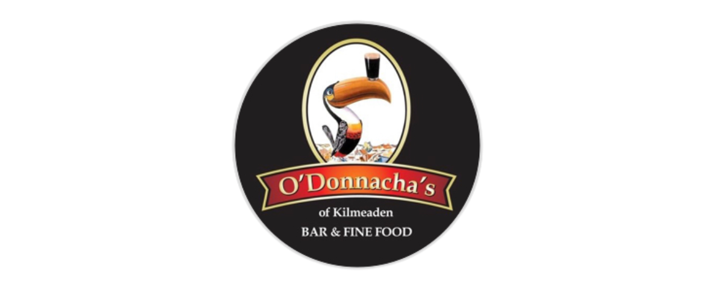

## O'Donnachas Gastropub

### Project Description

#### This project will showcase the location, menus, contact info, services for the gastropub

This site is aimed at giving you information about the gastropub O'Donnachas of Kilmeaden. Showcasing the food and drinks available, they great coutry pub atmosphere, friendly staff and warm welcome. It will dispaly location and contact information.

### Table of Contents

## Roadmap

- Static website, menu, contact info, location, services
- Review section
- Social media integration
- Table reservation booking system

## UX

### User Goal

- Familiar design, mobile first
- Clear and quality images
- Easily navigatable
- Quality relevant content
- Location & contact info easily found
- Simple contact us form
- Links to all socials

### User Story

- As a user, I want to be able to navigate the website easily
- As a user, I want to be able to see what services you have available
- As a user, I want to be see images of the food you have
- As a user, I want to easily find you
- As a user, I want ways to contact you to be seen

### Owner Goals

- Increase ranking on search engines
- Easily contactable through multiple methods
- Convey the type of establisment and atmosphere

## Design

### Font

In order to get a nice feel and complementary fonts I used (https://fonts.google.com/) in order to select the best fonts I felt for the page. Using (https://fonts.google.com/) I added the following fonts - Poppins

### Colors

Using the current color set of the bar, I chose a color pallete using (https://coolors.co/)

### Icons

### Structure

Based on current user experiences, I am choosing to go with a Mobile first approach. Using a single scrollable page with snap scrolling. I will modeling on iPhone 15 & Glaxay S20. I will be using breakpoints to make the page responsive for larger screens.

## Wireframes

Using Figma I have created initially the mobile first look and feel then scaled based on larger screen requirements

## Features

### Navigation

- Nav bar will remain fixed to the top and responsive to screen size. It will contain the menu items to move around the sections and the bar logo

### Hero Section

- Hero will contact a large image with a text overly giving a short description of the gastropub

### Who We Are Section

- Color block with text to explain a little about the place, history.

### Services Section

- Services displayed on individual cards, allowing users to see quickly what is on offer

### Contact Us Section

- Full contact information provided plus an email us form

### Location Section

- Embedded good maps location plus address details

### Footer

- Social media links and copywright information

## Technologies

### Language

- HTML/CSS

### Tools

- VSCode
- Github
- Figma
- HTML Validator
- CSS Validator
- Unsplash

## Testing

## Bugs

- Form not sending correctly - Open

- Contact Us and Find Us not linking correctly - Resolved
- Overflow of nav grid on mobile - Resolved
- Images not displaying when deployed - Resolved

## Deployment

Once code has been completed, it is pushed to Github for deployment using the pages feature. The site is now accessible via:

- Link here

## Contributions

- Simen Daehlin
- Mate Rizco
